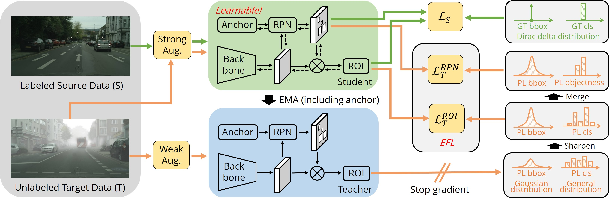

# Learning Domain Adaptive Object Detection with Probabilistic Teacher



This repo is the official implementation of ICML2022 paper "[Learning Domain Adaptive Object Detection with Probabilistic Teacher](https://arxiv.org/pdf/2206.06293.pdf)" by Meilin Chen, Weijie Chen, Shicai Yang, *et al*. If you have any problem about this work, please feel free to contact Meilin Chen (merlinis-at-zju.edu.cn) or Weijie Chen (chenweijie5-at-hikvision.com).

## Installation

### Prerequisites
```shell
pip install -r requirements.txt
```

### Install Detectron2
Follow the [INSTALL.md](https://github.com/facebookresearch/detectron2/blob/master/INSTALL.md) to install Detectron2. We use version: ```detectron2==0.5```

## Usage

### Data Preparation
Plz refer to [prepare_data.md](docs/prepare_data.md) for datasets preparation.

### Pretrained Model

We used VGG16 pre-trained on ImageNet for all experiments. You can download it to ```/path/to/project```:

- VGG16: [Dropbox](https://www.dropbox.com/s/s3brpk0bdq60nyb/vgg16_caffe.pth?dl=0), [VT Server](https://filebox.ece.vt.edu/~jw2yang/faster-rcnn/pretrained-base-models/vgg16_caffe.pth)

### Training
Plz refer to [get_started.md](docs/get_started.md) for detailed commands.

## Main Results
This code has been further improved,  achiving more superior adaptation performance than the results presented in the paper (about +1~2 mAP gains across the tasks, see exps logs for details).
|Adaptation Tasks |Methods|Model Weights | mAP50                 | Log |
| ---- | -------| ----- |------------------------------|------------------------------|
|CitysScape2FoggyCityscape| PT (ours) | [Google Drive](https://drive.google.com/drive/folders/1rMXAaJpgOOHycnGhL2RwLJaz6dspmb74?usp=sharing) | **31 &rArr; 47.1 (+16.1)**   | [Google Drive](https://drive.google.com/drive/folders/1rMXAaJpgOOHycnGhL2RwLJaz6dspmb74?usp=sharing) |
|CitysScape2BDD100k| PT (ours) | [Google Drive](https://drive.google.com/drive/folders/1rMXAaJpgOOHycnGhL2RwLJaz6dspmb74?usp=sharing) | **26.9 &rArr; 34.9 (+8.0)**  |[Google Drive](https://drive.google.com/drive/folders/1rMXAaJpgOOHycnGhL2RwLJaz6dspmb74?usp=sharing)  |
|KITTI2CitysScape| PT (ours) | [Google Drive](https://drive.google.com/drive/folders/1rMXAaJpgOOHycnGhL2RwLJaz6dspmb74?usp=sharing) | **46.4 &rArr; 60.2 (+13.8)** | [Google Drive](https://drive.google.com/drive/folders/1rMXAaJpgOOHycnGhL2RwLJaz6dspmb74?usp=sharing) |
|Sim10k2CitysScape|PT (ours) | [Google Drive](https://drive.google.com/drive/folders/1rMXAaJpgOOHycnGhL2RwLJaz6dspmb74?usp=sharing) | **44.5 &rArr; 55.1 (+10.6)** | [Google Drive](https://drive.google.com/drive/folders/1rMXAaJpgOOHycnGhL2RwLJaz6dspmb74?usp=sharing) |


## Citation

If you use Probabilistic Teacher in your research or wish to refer to the results published in the paper, please consider citing our paper:
```BibTeX
@inproceedings{chen2022learning,
  title={Learning Domain Adaptive Object Detection with Probabilistic Teacher},
  author={Chen, Meilin and Chen, Weijie and Yang, Shicai and Song, Jie and Wang, Xinchao and Zhang, Lei and Yan, Yunfeng and Qi, Donglian and Zhuang, Yueting and Xie, Di and others},
  booktitle={International Conference on Machine Learning},
  pages={3040--3055},
  year={2022},
  organization={PMLR}
}
```

## License

This project is released under the [Apache 2.0 license](./LICENSE). Other codes from open source repository follows the original distributive licenses.

## Acknowledgement

This project is built upon [Detectron2](https://github.com/facebookresearch/detectron2) and [Unbiased Teacher](https://github.com/facebookresearch/unbiased-teacher), and we'd like to appreciate for their excellent works.